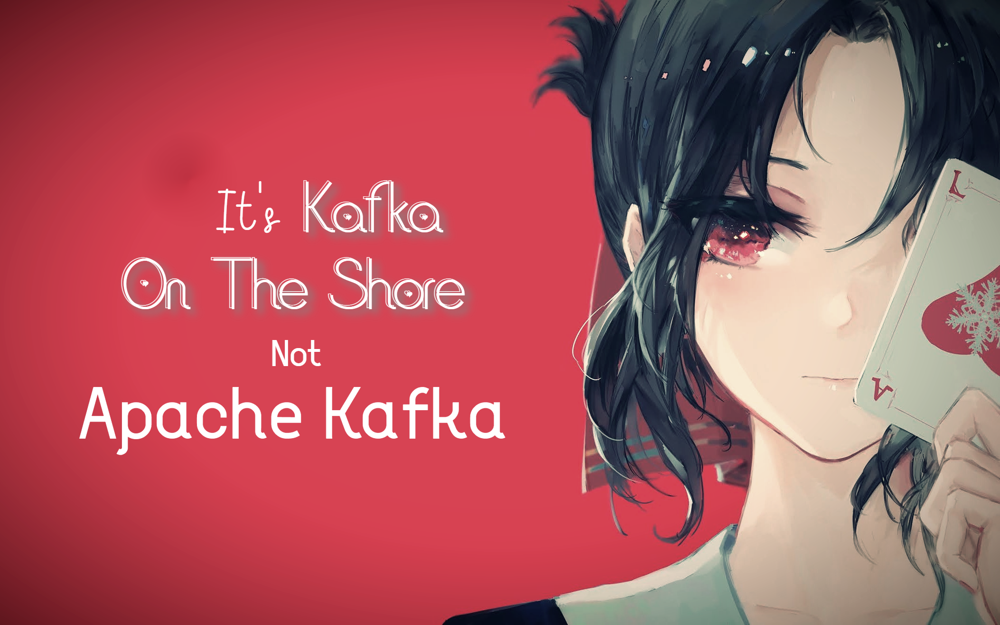

<!DOCTYPE html>
<html lang="en">
  <head>
    <meta charset="UTF-8" />
    <meta name="viewport" content="width=device-width, initial-scale=1.0" />
    <!-- <link rel="stylesheet" href="assests/css/style.css" /> -->
  </head>
  <body>
    

      
      

        
      

    

  </body>
</html>
